# ICS-Common-Protocal-Simulator
 ICS Common Protocal Simulator工控常见协议模拟仿真工具集

***所有资料均来源于互联网收集而来，工具安全性自查，侵删***

------

## bacnet

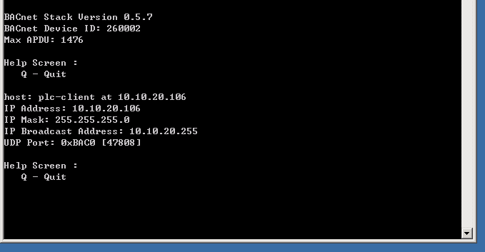

nmap扫描识别

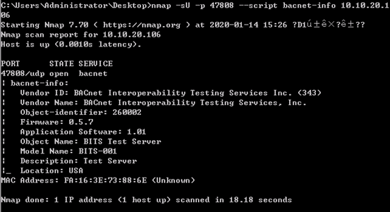

## dnp3

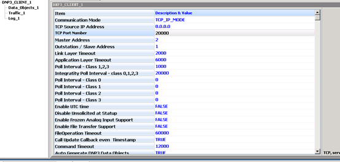

nmap扫描识别

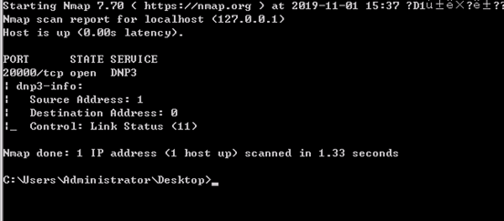

## iec104

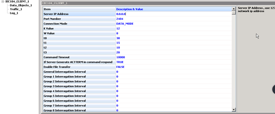

nmap扫描识别

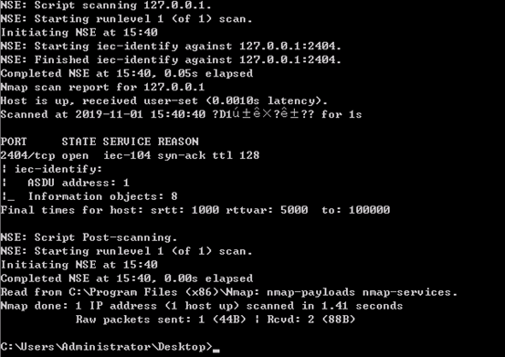

## modbus

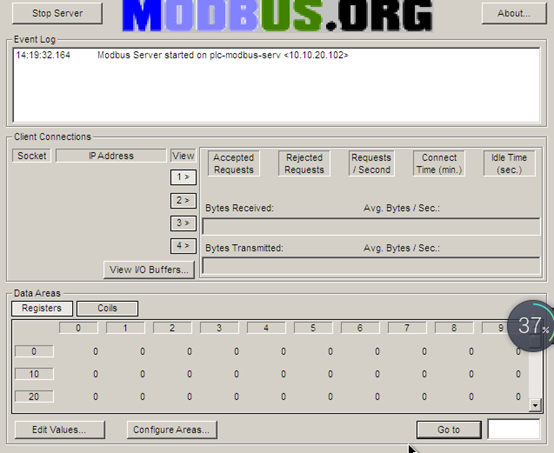

nmap扫描识别

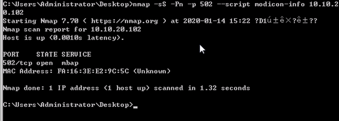

## s7

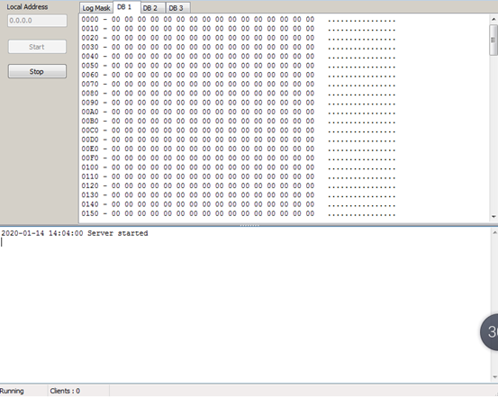

nmap扫描识别

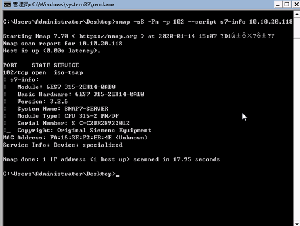

## multiple

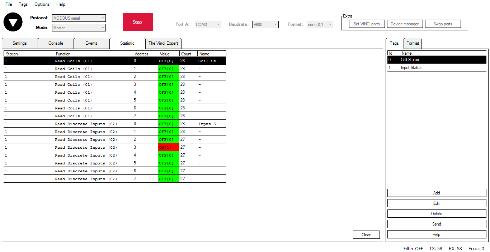

## 参考

<https://ricolsen1supervc.wordpress.com/2017/07/01/free-tools-for-testing-communication-protocols/>

<https://www.key1.top/index.php/archives/621/>

<https://github.com/>

